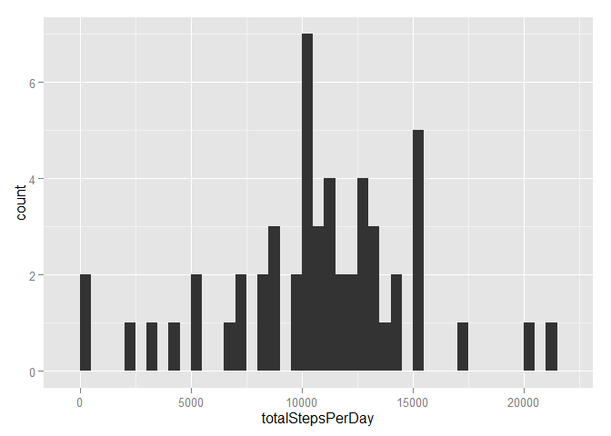
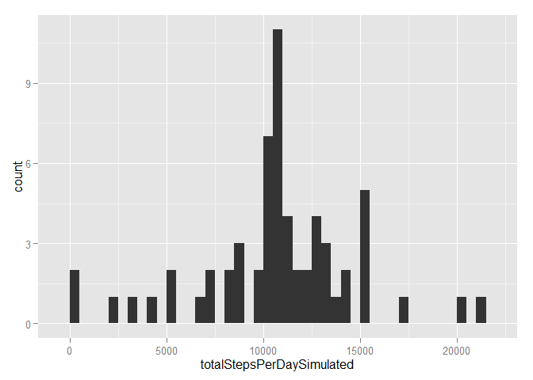
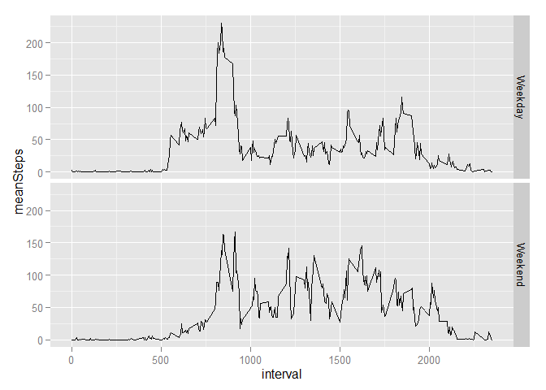

# Reproducible Research: Peer Assessment 1

## Loading and preprocessing the data

Load in the data.

```r
unzip("activity.zip")
act <- read.csv("activity.csv")
```

Load required libraries.

```r
library(ggplot2)
library(dplyr)
```

Explore the data to determine preprocessing needed.

```r
# str(act)        # date needs to be formatted
# summary(act)    # NAs are present in data frame
act$date <- as.Date(act$date, "%Y-%m-%d")
act_noNA <- act[!is.na(act$steps),]
```


## What is mean total number of steps taken per day?

```r
totalStepsPerDay <- tapply(act_noNA$steps, act_noNA$date, FUN=sum)
```

The total no. of steps taken per day is:

```r
totalStepsPerDay
```

```
## 2012-10-02 2012-10-03 2012-10-04 2012-10-05 2012-10-06 2012-10-07 
##        126      11352      12116      13294      15420      11015 
## 2012-10-09 2012-10-10 2012-10-11 2012-10-12 2012-10-13 2012-10-14 
##      12811       9900      10304      17382      12426      15098 
## 2012-10-15 2012-10-16 2012-10-17 2012-10-18 2012-10-19 2012-10-20 
##      10139      15084      13452      10056      11829      10395 
## 2012-10-21 2012-10-22 2012-10-23 2012-10-24 2012-10-25 2012-10-26 
##       8821      13460       8918       8355       2492       6778 
## 2012-10-27 2012-10-28 2012-10-29 2012-10-30 2012-10-31 2012-11-02 
##      10119      11458       5018       9819      15414      10600 
## 2012-11-03 2012-11-05 2012-11-06 2012-11-07 2012-11-08 2012-11-11 
##      10571      10439       8334      12883       3219      12608 
## 2012-11-12 2012-11-13 2012-11-15 2012-11-16 2012-11-17 2012-11-18 
##      10765       7336         41       5441      14339      15110 
## 2012-11-19 2012-11-20 2012-11-21 2012-11-22 2012-11-23 2012-11-24 
##       8841       4472      12787      20427      21194      14478 
## 2012-11-25 2012-11-26 2012-11-27 2012-11-28 2012-11-29 
##      11834      11162      13646      10183       7047
```

Histogram of the total no. of steps taken each day.

```r
# range(totalStepsPerDay)/30               # to determine suitable bin width
qplot(totalStepsPerDay, binwidth=500)
```

 

The mean total no. of steps per day is: 1.0766189\times 10^{4} (`mean(totalStepsPerDay)`)  
The median total no. of steps per day is: 10765 (`median(totalStepsPerDay)`)


## What is the average daily activity pattern?


```r
act_grpByIntervals <- act_noNA %>%
                      group_by(interval) %>%
                      summarise(meanSteps=mean(steps))

g <- ggplot(act_grpByIntervals, aes(x=interval, y=meanSteps))
g <- g + geom_line()
g
```

 

The 5-minute interval that contains the max. no. of steps on average: 835 (`act_grpByIntervals[which.max(act_grpByIntervals$meanSteps),1]`)


## Imputing missing values

The no. of rows with missing data:

```r
which(is.na(act)) %>% unique() %>% length()
```

```
## [1] 2304
```

The means of the respective 5-minute intervals is used to replace the missing data.

```r
rowIdsForNAs <- which(is.na(act$steps))
intervalsAtNAs <- act$interval[rowIdsForNAs]

act_simulatedNAs <- act                 # make replacement on new df

act_simulatedNAs$steps[rowIdsForNAs] <- act_grpByIntervals$meanSteps[
                                        match(intervalsAtNAs, act_grpByIntervals$interval)]

totalStepsPerDaySimulated <- tapply(act_simulatedNAs$steps, act_simulatedNAs$date, FUN=sum)
```

Histogram of the total no. of steps taken each day.

```r
# range(totalStepsPerDaySimulated)/30               # to determine suitable bin width
qplot(totalStepsPerDaySimulated, binwidth=500)
```

 

The mean total no. of steps per day is: 1.0766189\times 10^{4} (`mean(totalStepsPerDaySimulated)`)  
The median total no. of steps per day is: 1.0766189\times 10^{4} (`median(totalStepsPerDaySimulated)`)

After imputing missing values:  
1. The mean total no. of steps per day remains the same;  
2. The median total no. of steps per day has increased towards to mean.


## Are there differences in activity patterns between weekdays and weekends?

A new column with factors "Weekend" and "Weekday" is introduced.

```r
act_ByDayOfWeek <- act_simulatedNAs     # to introduce new factor column
act_ByDayOfWeek$Day <- weekdays(act_ByDayOfWeek$date, abbreviate=TRUE)
act_ByDayOfWeek$Day <- ifelse(act_ByDayOfWeek$Day %in% c("Sat", "Sun"), "Weekend", "Weekday")
act_ByDayOfWeek$Day <- as.factor(act_ByDayOfWeek$Day)

act_ByDayOfWeekGrp <- act_ByDayOfWeek %>%
                      group_by(interval, Day) %>%
                      summarise(meanSteps=mean(steps))
```

Panel plot of average no. of steps taken by 5-minute intervals, faceted by "Weekend" and "Weekday"

```r
g2 <- ggplot(act_ByDayOfWeekGrp, aes(x=interval, y=meanSteps))
g2 <- g2 + facet_grid(Day ~ .) + geom_line()
g2
```

 

